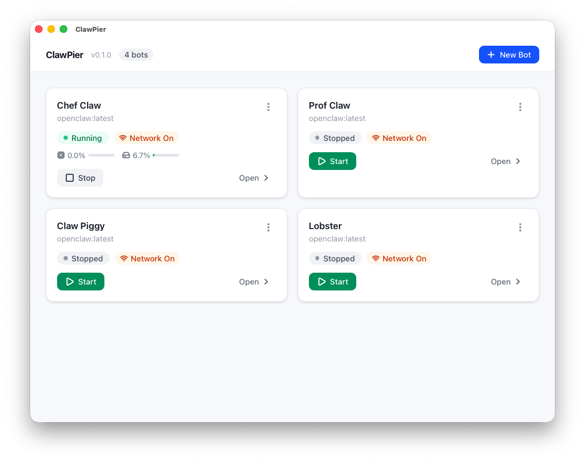

# ClawPier

A native macOS desktop app for managing sandboxed [OpenClaw](https://github.com/openclaw) bot instances via Docker.

Built with **Tauri v2** (Rust backend + React frontend).



## What it does

ClawPier gives you a visual, approachable way to run OpenClaw AI agents — no terminal required.

- **Create and manage multiple bots** from a clean dashboard
- **Sandbox by default** — containers run with `--network none`; network access is opt-in per bot
- **Interactive terminal** — full PTY shell into any running container
- **Live logs** — real-time streaming with timestamp display
- **Dashboard** — see your bot's OpenClaw config, model, channels, and Telegram info at a glance
- **File browser** — browse and preview files in your bot's workspace
- **Resource monitoring** — live CPU, memory, and network I/O per bot
- **Environment variables** — configure secrets and settings per bot without touching config files

## Install

### From release (recommended)

Download the latest `.dmg` from [Releases](https://github.com/SebastianElvis/clawpier/releases), open it, and drag ClawPier to Applications.

### Prerequisites

- **macOS** (primary target)
- **Docker Desktop** — must be installed and running
- OpenClaw Docker image (ClawPier will prompt you to pull it on first launch)

## Build from source

Requires Rust toolchain (`rustup`), Node.js >= 18, and pnpm.

```bash
pnpm install          # Install frontend dependencies
pnpm tauri dev        # Run in development mode (hot-reload)
pnpm tauri build      # Build release .app + DMG
```

The built app is at `src-tauri/target/release/bundle/macos/ClawPier.app`.

## How it works

```
┌─────────────────────────────────────┐
│           React Frontend            │
│  (Zustand store ← Tauri events)     │
├─────────────────────────────────────┤
│          Tauri IPC Bridge           │
│    invoke() ↔ #[tauri::command]     │
├─────────────────────────────────────┤
│           Rust Backend              │
│  DockerManager · BotStore · State   │
├─────────────────────────────────────┤
│      Docker Engine (bollard)        │
│  /var/run/docker.sock               │
└─────────────────────────────────────┘
```

- Each bot gets its own Docker container (`clawpier-{uuid}`)
- Bot profiles are saved locally at `~/.config/clawpier/bots.json`
- OpenClaw config persists across container restarts via host bind mounts
- Status updates stream to the UI every 5 seconds via Tauri events

## Tech stack

| Layer | Technology |
|-------|-----------|
| Framework | Tauri v2 |
| Frontend | React 19, TypeScript, Tailwind CSS v4, Zustand |
| Backend | Rust, bollard 0.18 (Docker API), tokio |
| Package manager | pnpm |

## Contributing

Contributions are welcome. Please open an issue first to discuss what you'd like to change.

## License

[MIT](LICENSE)
