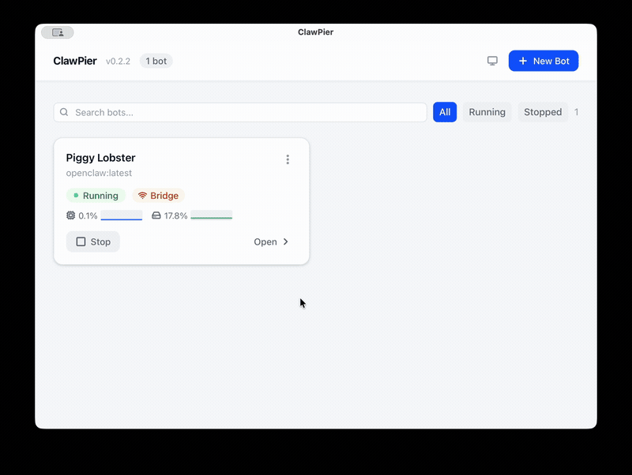

# ClawPier

**AI agents have OS-level access to your machine. ClawPier runs them in a sandbox.**

[](https://github.com/SebastianElvis/clawpier/releases)
[](LICENSE)
[](https://github.com/SebastianElvis/clawpier/stargazers)
[](https://v2.tauri.app)

A native desktop app for managing [OpenClaw](https://github.com/openclaw) and [Hermes](https://github.com/nousresearch/hermes-agent) AI agent instances inside Docker containers — sandboxed from your host by default. Available on macOS, Linux, and Windows.

<p align="center">
  
  <br />
  <sub><a href="https://github.com/SebastianElvis/clawpier/releases/download/v0.3.0/clawpier-demo.mov">&#9654; Watch full demo (60s)</a></sub>
</p>

## Why ClawPier?

AI agent runtimes like OpenClaw and Hermes have OS-level access to your email, calendars, files, and messaging platforms. Running them directly on your host means a prompt injection gives an attacker your machine ([CVE-2026-25253](https://nvd.nist.gov/vuln/detail/CVE-2026-25253), CVSS 8.8).

ClawPier fixes this by running every agent inside a Docker container:

- **Sandboxed by default** — containers start with `--network none`; network access is opt-in per bot
- **Resource limits** — set CPU and memory caps from the GUI, not Docker flags
- **One-click stop** — kill a misbehaving agent instantly; your host is never at risk
- **No CLI required** — full GUI for everything: chat, config, terminal, logs, files, monitoring

Built with **Tauri v2** (Rust backend + React frontend) — ~10x smaller than Electron. macOS builds are code-signed and notarized.

## Install

### Homebrew (macOS)

```bash
brew tap SebastianElvis/clawpier
brew install --cask clawpier
```

### Download

Grab the latest build for your platform from [Releases](https://github.com/SebastianElvis/clawpier/releases):

| Platform | Format |
|----------|--------|
| macOS (Apple Silicon) | `.dmg` (signed & notarized) |
| macOS (Intel) | `.dmg` (signed & notarized) |
| Linux (x86_64) | `.AppImage` or `.deb` |
| Windows (x86_64) | `.exe` installer or `.msi` |

### Prerequisites

- **Docker** must be installed and running (Docker Desktop on macOS/Windows, or Docker Engine on Linux)
- Agent Docker image (OpenClaw or Hermes) — ClawPier will prompt you to pull it on first launch

## Features

### Multi-Agent Support
- **OpenClaw and Hermes** — choose your agent runtime when creating a bot
- **Agent-specific config dashboards** — view model, provider, platforms, and settings per agent type
- **Image pull progress** — real-time progress bar with layer and byte tracking

### Bot Management
- **Create and manage multiple bots** from a clean dashboard
- **Sandbox by default** — containers run with `--network none`; network access is opt-in per bot
- **Auto-start** — configure bots to start automatically when ClawPier launches
- **Health checks** — configurable health checks with automatic restart on failure

### ClawHub Skill Browser
- **Browse 50+ bundled skills** with readiness status (dependencies met or missing)
- **Search the ClawHub registry** to discover and install community skills
- **One-click install/uninstall** directly from the GUI
- **Skill detail view** with metadata, author, and dependency info

### Development Tools
- **Interactive terminal** — full PTY shell into any running container
- **Live logs** — real-time container log streaming with timestamps
- **File browser** — browse and preview files in your bot's workspace
- **Resource monitoring** — live CPU, memory, and network I/O per bot

### Configuration
- **Dashboard** — see your bot's config, model, channels, and platform info at a glance
- **Port mapping presets** — quick setup for webhooks, APIs, and WebSocket with port conflict detection
- **Environment variables** — configure secrets and settings per bot
- **Resource limits** — set CPU and memory limits per container
- **Network mode** — choose between sandbox (none), bridge, host, or custom networks

### Desktop Experience
- **Dark mode** — system theme detection with manual toggle
- **Keyboard shortcuts** — quick actions for common operations
- **Status notifications** — toast alerts for bot crashes and unexpected stops
- **Window state persistence** — remembers your selected bot, active tab, and panel layout

## Build from source

Requires Rust toolchain (`rustup`), Node.js >= 18, and pnpm.

On Linux, install system dependencies first:

```bash
sudo apt install libwebkit2gtk-4.1-dev libgtk-3-dev libayatana-appindicator3-dev librsvg2-dev patchelf
```

```bash
pnpm install          # Install frontend dependencies
pnpm tauri dev        # Run in development mode (hot-reload)
pnpm tauri build      # Build release binary + installers
```

## Architecture

```
+-------------------------------------+
|           React Frontend            |
|  (Zustand store <- Tauri events)    |
+-------------------------------------+
|          Tauri IPC Bridge           |
|    invoke() <-> #[tauri::command]   |
+-------------------------------------+
|           Rust Backend              |
|  DockerManager . BotStore . State   |
+-------------------------------------+
|      Docker Engine (bollard)        |
|  /var/run/docker.sock               |
+-------------------------------------+
```

- Each bot gets its own Docker container (`clawpier-{uuid}`)
- Bot profiles are saved locally at `~/.config/clawpier/bots.json`
- Agent config persists across container restarts via host bind mounts
- Status updates stream to the UI every 5 seconds via Tauri events

## Tech stack

| Layer | Technology |
|-------|-----------|
| Framework | Tauri v2 |
| Frontend | React 19, TypeScript, Tailwind CSS v4, Zustand |
| Backend | Rust, bollard 0.18 (Docker API), tokio |
| Build | Vite 6, pnpm |
| CI/CD | GitHub Actions (cross-platform builds, code signing, Homebrew tap) |

## Contributing

Contributions are welcome! Please open an issue first to discuss what you'd like to change.

## License

[MIT](LICENSE)
